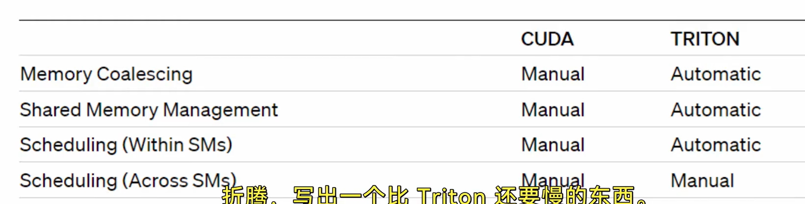

## Notes for Lecture 1: Profiling CUDA kernels in PyTorch

### Key Points

- Pytorch Profiler

- Triton Profiler

- CUDA Profiling with ncu

### Takeaway

- 在pytorch，CUDA调用计时使用`torch.cuda.Event()`和`torch.cuda.synchronize()`，因为CUDA调用是async（异步）的

- torch.cpp_extensions的`load_inline()`可以方便地将cpp cuda代码自动编译和执行，内部创建了main函数和cuda文件，使用pybind绑定。输出见`build_directory`所指定的目录

- TODO: Triton的PTX code，输入输出都默认8个register（为什么？）

- TODO: What is "Long Scoreboard Stalls" and "Tail Effect"?
    
    - Tail Effect: Try padding

    - Long scoreboard stalls: always caused by memory bandwidth or latency with GPU. Try to use shared memory

- Triton and CUDA

